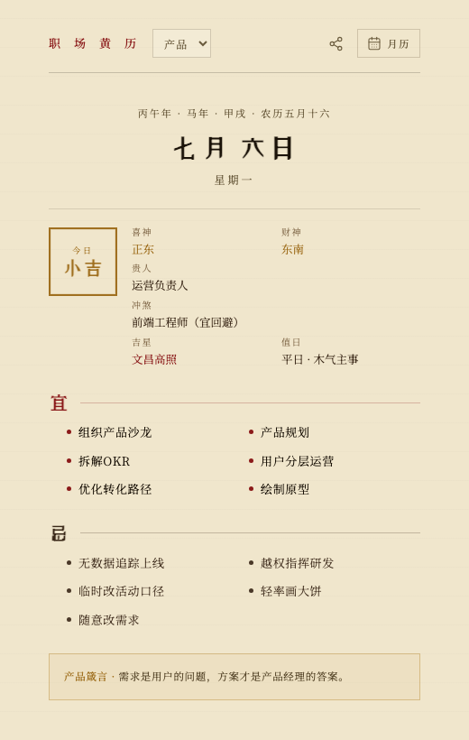

# 职场黄历

面向产品、开发、测试、项目和运营同学的职场黄历。它会根据日期和岗位生成当天的运势、宜忌事项、贵人/冲煞、吉星和值日信息，用一点传统黄历的仪式感包装日常协作建议。

## 项目链接

- 在线预览：[https://noir-hedgehog.github.io/pm-calendar/](https://noir-hedgehog.github.io/pm-calendar/)
- GitHub 仓库：[https://github.com/noir-hedgehog/pm-calendar](https://github.com/noir-hedgehog/pm-calendar)

## 截图



## 主要功能

- 支持产品、开发、测试、项目、运营等岗位切换，生成对应的当日建议。
- 展示每日运势、宜做/忌做事项、喜神、财神、贵人、冲煞、吉星和值日。
- 提供月历视图，可按日期查看不同日子的职场宜忌。
- 支持生成分享图片，方便保存或转发当天黄历。
- 使用固定日期种子生成结果，同一天同一岗位看到的内容保持一致。

## 本地运行

```bash
npm install
npm run dev
```

构建生产版本：

```bash
npm run build
```

